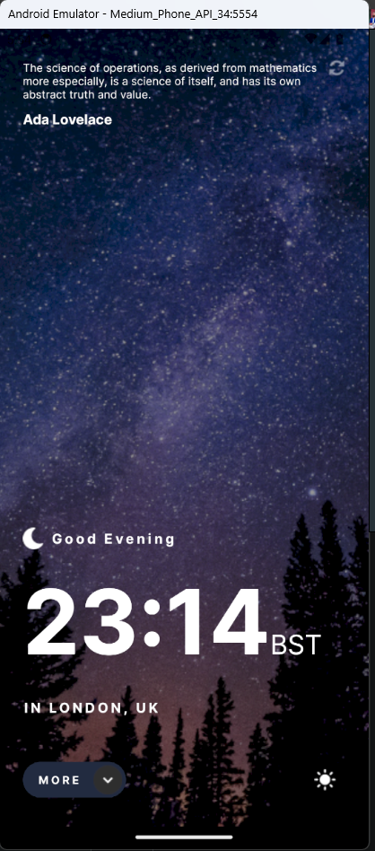

# React Native Assignment 2: Design Implementation

This repository contains the implementation of a design using React Native, as specified in Assignment 2.

## Design Overview

The design to be implemented can be found in the following Figma link:
[Design Figma Link](https://www.figma.com/file/qmuiTFkqOcWfFVp9gvBhPc/Untitled?type=design&node-id=0%3A1&mode=design&t=SKIEDfaj4aHcb6cc-1)

## Features

- Implementation of the design using React Native
- Light/dark mode toggle button

## Screenshots

## Prerequisites

Before getting started, ensure you have the following prerequisites installed on your machine:

- Node.js
- React Native CLI
- Git

## About Me

- **Name:** Faysal Hossain
- **LinkedIn:** [Faysal's LinkedIn Profile](https://www.linkedin.com/in/f4faysal)
- **Portfolio:** [Faysal's Portfolio](http://f4faysal.vercel.app/)

Feel free to reach out if you have any questions or suggestions!